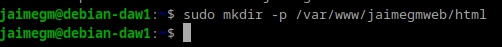
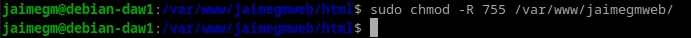
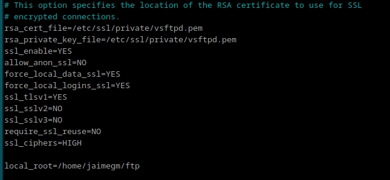

# Practica 2.1: Instalación y Configuración de Servidor Web Nginx

### Jaime Grueso Martin

## Indice
1. [Instalación Servidor Web Nginx](#id1)
2. [Creación de la Carpeta del Sitio Web](#id2)
3. [Configuración de Servidor Web NGINX](#id3)
4. [Comprobaciones](#id4)
5. [FTP](#id5)
6. [HTTPS](#id6)

## Instalación Servidor Web Nginx
En esta práctica de procederá a instalar Nginx en Debian 12. Para ello el primer paso a seguir
es la instalación. Para ello se ejecutarán los siguintes comandos:

Hecho esto se verificará que la instalación ha tenido éxito ejecutando el siguiente comando:

## Creación de la Carpeta del Sitio Web
Una vez instalado el sevidor, se procederá a la creación de la carpeta que albergará
el sitio web (normalmente se utiliza /var/www). Se ejecutará el siguiente comando:

Dentro de la carpeta `html` se debe clonar el siguiente repositorio:
´https://github.com/cloudacademy/static-website-example.git´. Para ello
se inicializará un repositorio en dicha carpeta: 

Se usará la orden sudo git clone para evitar problemas con los permisos del directorio.

Y para asegurarse de no tener problemas a la hora de poner en marcha el servidor, se 
hará propietario al usuario `www-data`.

En complemento al paso anterior, se le darán permisos para poder entrar sin problemas a la web:

Se comprobará que la configuración accediendo al siguiente enlace:
`http://IP-maq-virtual`

Si todo ha ido bien, deberá aparecer esto cuando accedamos a la url:

## Configuración de servidor web NGINX
En Nginx hay dos rutas diferenciadas, `sites-available` y `sites-enabled`. La primera son archivos de los hosts, las webs que alberga
el servidor. La otra son archivos de configuracion de los sitios que estan funcionando.

En `sites-available` hay un archivo de configuración por defecto (default), que es la que nos ha aparecido en el apartado anterior.

Para que Nginx presente el contenido de nuestra web, es necesario crear un bloque de servidor con las directivas correctas. En vez de modificar el archivo de configuración predeterminado directamente, crearemos uno nuevo en `/etc/nginx/sites-available/nombre_web`:

Y en el archivo creado se escribirá el siguiente código:

Después de guardar el archivo de configuración, se creará un enlace simbólico en el directorio `sites-enabled` para que Nginx cargue tu configuración.

Se reiniciará para aplicar todos los cambios.

Se podrá realizar una comprobación para asegurarse de que todo lo hecho anteriormente es correcto:

## Comprobaciones
### Comprobación del correcto funcionamiento

Al no poseer un servidor DNS, se hará el proceso manualmente.

Primeramente se editará el fichero `C:\Windows\System32\drivers\etc\hosts` 
para que asocie la IP de la máquina virtual nmbre de nuestro servidor.

**Debian** => `ip a`

### Comprobar Registros de Servidor
Se comprobará que todo lo que suceda en el servidor, se registre en los archivos de logs.

`/var/log/nginx/access.log`: se registrarán las solicitudes al servidor

`/var/log/nginx/error.log`: cualquier error se mostrará en este archivo.

## FTP
Si se desea alojar varios dominios o sitios web en el mismo servidor Nginx (es decir, todos compartirán la misma dirección IP), se necesitará repetir el proceso mencionado anteriormente para cada nuevo dominio que se desee configurar.

### ¿Cómo transferir archivos desde nuestra máquina local/anfitrión a nuestra máquina virtual Debian/servidor remoto?

FTP (File Transfer Protocol) es un protocolo utilizado para la transferencia de archivos entre dispositivos conectados a una red TCP. Como su nombre lo indica, permite mover archivos directamente de un equipo a otro.

El problema con el FTP original es que es un protocolo inseguro, ya que los datos se transmiten sin cifrar. Esto se solucionó con el desarrollo de SFTP, que agrega una capa de seguridad SSH para proteger la transferencia de archivos.

SFTP (SSH File Transfer Protocol) es una versión mejorada del FTP, ya que utiliza un canal seguro basado en SSH.

La principal ventaja de SFTP radica en la seguridad que ofrece durante la transferencia de archivos. Sin esta protección, los datos se transmiten sin cifrar, lo que significa que cualquiera puede acceder a la informacion.

### Configurar servidor SFTP en Debian
El primer paso es instalar el  SFTP

A continuación se creará un directorio llamada FTP:

En la configuración de vsftpd se indicará que este será el directorio al que se cambie después de conectarse el usuario.

Ahora se crearán los certificados de seguridad para cifrar la conexión

Hecho esto, se prodrá realizar la configuración de vsftpd. Para ello se berá editar el archivo `sudo nano /etc/vsftpd.conf`

Primero, se deberán eliminar las siguientes líneas, que aparecen al final del documento.

Y se añadirán estas en su lugar

Finalmente, se reiniciará el servidor para aplicar los cambios.

Una vez finalizada la configuración previa, se podrá acceder al servidor mediante un cliente FTP (Filezilla)
Tras la descarga, se introducirán los datos necesarios para realizar la conexion al servidor FTP en Debian:

Se rellenarán los campos que aparecen en la imagen y se hará click en "Conexion rápida"

Aparecerá un aviso y le damos a aceptar:

Con esto, se establecerá una conexion con la carpeta indicada en el archivo de configuración

Para comprobar que funciona correctamente, se transferirá un fichero de una máquina a otra.

Es recomendable que el puerto sea el 22 ya que se utiliza el protocolo SFTP ya que cifran mediante SSH los datos, a diferencia
del puerto 21 que se quedan sin cifrar pero con los certificados se cifra la información.

## HTTPS
Se hará que todos nuestros sitios web utilicen certificados SSL y se acceda a ellos por medio de HTTPS. Se generarán unos 
certificados autofirmados y habrá que modificar el fichero de configuración de los hosts virtuales con los parámetros necesarios.

### Redirección HTTP a HTTPS
Cuando el usuario acceda al sitio web mediante HTTP, se le redirijirá a HTTPS, en el puerto 443.

Para empezar, se deberá instalar OpenSSL, una herramienta que te permitirá crear certificados sin necesidad de una autoridad certificadora.
Se generará una clave privada y un certificado autofirmado.

Se editará el archivo de configuración de Nginx.

Y se modificará de la siguiente manera

Hecho esto, habrá que mofificar el archivo `hosts` de nuestra máquina física.

Si todo ha ido bien al colocar en cualquier buscador `http://www.jaimegmweb.com`, se cambiará a
`https` y se mostrará un mensaje de alerta. Esto es debido a que el certificado es autofirmado y 
aparecerá que el sitio no es seguro.

Se obviará este aviso y se procederá a visualizar el contenido de la web:

En una situacion real, se deberá hacer uso de un certificado firmado válido como los generados por Certbot.